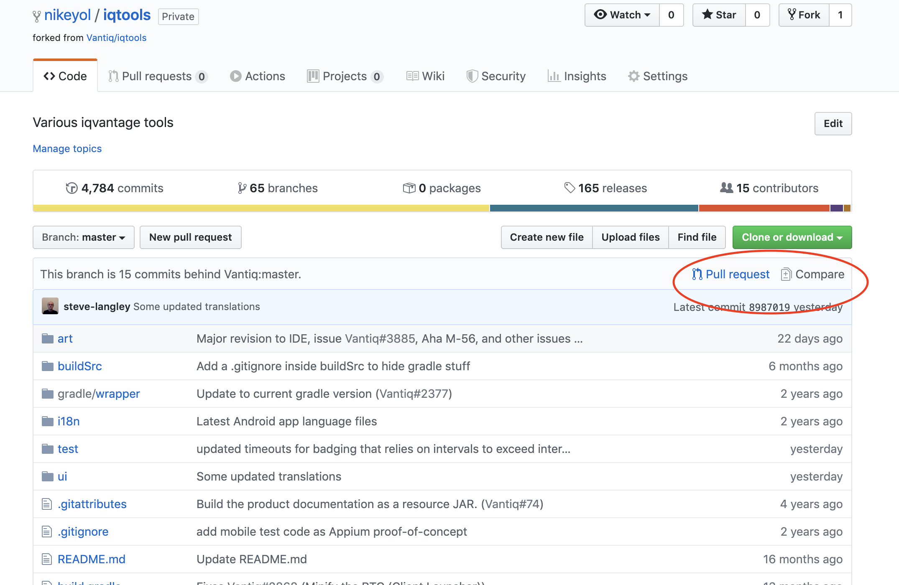

# PR submit process for i18N of VANTIQ

## Fork the related repos to your own repo:
```text

IDE property file: https://github.com/Vantiq/iqtools.git
Markdown files: https://github.com/Vantiq/docs.git

```

## Submmit the PR to vantiq/docs

### Clone vantiq/docs to local
```text
git clone https://github.com/nikeyol/docs.git

```
### Add and merge the latest update from upstream
```text

git remote add upstream  https://github.com/Vantiq/docs.git
git checkout master
git fetch upstream
git merge upstream/master

```

### Create a new branch
```text
git checkout -b cn_whitelabel

```

### Copy all modified md files into the dir docs/locale/zh/md/dev

### submit the changes into fork repos
```text

git add .
git commit -m"add mkdocs.yaml into zh repo"
git push origin cn_whitelable:cn_whitelable

```
### submit the PR in fork repo


